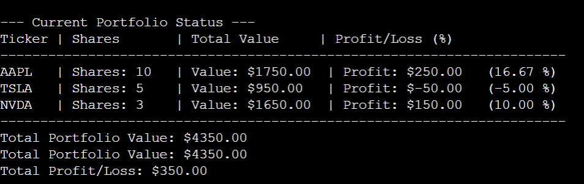

# 📈 Java Stock Portfolio Analyzer

A Java console application for managing and analysing a simple stock portfolio. The project was developed to practise **Object-Oriented Programming, Java collections, sorting and financial calculations**.

## 📊 Overview

The application allows a portfolio to contain multiple stocks and provides calculations and analysis based on their purchase and current prices.

Each stock stores:

* Ticker symbol
* Number of shares
* Purchase price
* Current price

The portfolio can then calculate its total value and overall profit/loss, as well as sort and identify individual stocks based on their performance.

## 🖥️ Example Output



## ✨ Features

* Add stocks to a portfolio
* Display individual stock information
* Calculate the current value of each stock
* Calculate profit/loss for individual stocks
* Calculate total portfolio value
* Calculate total portfolio profit/loss
* Sort stocks alphabetically by ticker
* Sort stocks by highest profit
* Sort stocks by highest percentage return
* Identify the best-performing stock
* Identify the worst-performing stock

## 🛠️ Technologies & Concepts

* **Java**
* Object-Oriented Programming
* Classes and objects
* Encapsulation
* `ArrayList`
* Lambda expressions
* Collection sorting
* Methods and constructors
* Console input/output
* Financial calculations

## 🏗️ Project Structure

```text
java-stock-portfolio-analyzer/
├── Main.java
├── Portfolio.java
├── Stock.java
└── README.md
```

### `Stock.java`

Represents an individual stock investment.

Stores the stock's ticker, number of shares, purchase price and current price. It also calculates the stock's current value, profit/loss and percentage return.

### `Portfolio.java`

Manages a collection of `Stock` objects using an `ArrayList`.

Provides functionality for calculating portfolio totals, sorting stocks and identifying the best and worst performing investments.

### `Main.java`

Creates example stocks, adds them to a portfolio and demonstrates the different analysis and sorting features.

## ▶️ Running the Project

### Requirements

* Java Development Kit (JDK)

### Run

Compile the Java files and run `Main.java` using a Java development environment or the command line.

No external libraries are required.

## 📚 What I Learned

Through this project I developed experience with:

* Designing Java programs using multiple classes
* Applying encapsulation through private fields and public methods
* Working with `ArrayList` to manage collections of objects
* Using lambda expressions to sort collections
* Separating responsibilities between classes
* Writing methods to perform calculations and analysis
* Formatting structured console output
* Handling empty collections when identifying the best and worst performing stocks

## 🚀 Possible Future Improvements

* Allow users to enter their own stocks through the console
* Add the ability to remove or update stocks
* Import stock data from a file
* Connect to a market data API for current prices
* Add portfolio performance charts
* Add transaction history and dividend tracking
* Add support for different currencies
